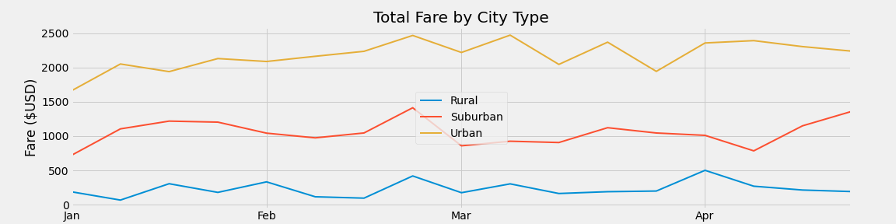

# PyBer Analysis

## Overview

The purpose of this analysis is to examine disparities in ride-sharing based on city types. Specifically, the ride-share availability and price in urban, rural, and suburban cities were examined with the goal of identifying trends and patterns in the distribution of ride-sharing access. The results from this analysis can provide actionable insights for decision makers to enhance ride-share access and fare equality across regions and types. 

## Results

### Drivers, Fares and Rides
To complete this analysis, two csv files containing ride data and city data were loaded and merged into one DataFrame to perform analysis on. The data showed distinct differences between city types in relationship to ride-share drivers, fares, and rides. For drivers, fares, and rides, urban cities had the highest amount, suburban cities had the second highest amount, and rural cities had the lowest amount. This is logically sound given the fact that more populous cities would have a higher number of people using ride-sharing apps, whereas less populous cities would have less people using ride-sharing apps. 

### Average Fare per Ride and Average Fare per Driver
Calculating the average fare per ride and average fare per driver showed that rural cities had the highest average fare, suburban cities had the second highest average fare, and urban cities had the lowest average fare. The most logical explanation for this metric is that less populous towns are often more spread out, meaning that those using ride-sharing apps will likely have to travel farther to their destination, which increases the fare. Conversely, more populous areas are usually quite dense with buildings and structures, creating a shorter distance between destinations for ride-share users and therefore creating smaller average fares.

### Total Fare by City Type
When calculating total fare by city type, the data demonstrated that urban cities had the highest total fare, suburban cities had the second highest, and rural cities had the lowest. Given the previous calculations on average fare, the amount of people using the ride-sharing app influences the total fare more so than the distance traveled. For example, a city that experiences 2,000 shorter, less expensive rides per night is likely to create a higher total fare than a city that experiences 300 rides per night that are longer and more expensive (these numbers are figurative and are not from the actual data). Figure 1 better illustrates this point by showing the total fares by city type for each week between the months of January and March in 2019.

### Figure 1

## Summary

Three key findings from this research that could potentially decrease ride-share inequality are as follows:

1.  Because rural cities have the lowest amount of drivers, ride-share companies could offer greater employment incentives like sign on bonuses to increase the amount of drivers.

2.  Because urban cities have the lowest average fare per ride, ride-share companies could increase the fares to pay drivers more money and reduce the discrepancy in average fare per ride. 

3. During seasonal lows like the beginning of March and mid April (as shown in Figure 1), ride-share companies could give riders coupons to increase the amount of rides. This would help drivers who rely on this income to weather changes in ride-share demand. 
